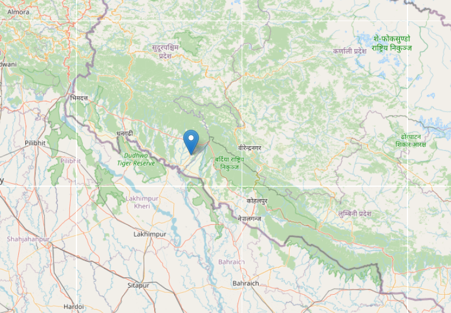

# Realtime Device Tracker

A minimal Express + Socket.IO + Leaflet app to broadcast browser geolocation in realtime and visualize all connected clients on a live map.

## Features
- Realtime location sharing with Socket.IO
- Interactive map powered by Leaflet and OpenStreetMap tiles
- Clean EJS view with static assets served from `public/`

## Tech Stack
- Express 5
- Socket.IO 4
- EJS
- Leaflet 1.9

## Project Structure
```
Realtime Device Tracker/
├─ app.js
├─ views/
│  └─ index.ejs
├─ public/
│  ├─ css/
│  │  └─ style.css
│  └─ js/
│     └─ script.js
├─ package.json
└─ README.md
```

## Prerequisites
- Node.js 18+ (tested with Node 22)
- npm

## Installation
```bash
npm install
```

## Run
- Start the server (default port: 4000):
```bash
node app.js
```
- Or with auto-reload during development:
```bash
npx nodemon app.js
```

Then open `http://localhost:4000` in one or more browsers/devices to see realtime updates as each client shares its location.

## Screenshot




## How It Works
- The browser uses `navigator.geolocation.watchPosition` to stream coordinates.
- The client emits `send-location` via Socket.IO.
- The server rebroadcasts as `receive-location` to all connected clients.
- Each client keeps a marker per socket id and updates positions live.

## Configuration

- Static files are served from `public/`.
- Views are in `views/` with EJS as the view engine.

```
Run with:
```bash
npm run start
# or
npm run dev
```

## Troubleshooting
- Address already in use (EADDRINUSE): another process is using the port. Either stop the other process or change the `PORT` in `app.js`.
- Blank map: ensure internet access to load Leaflet CSS/JS and OpenStreetMap tiles, and that `#map` has height (see `public/css/style.css`).
- Geolocation blocked: your browser may require HTTPS or explicit permission. For local dev, allow location access when prompted.

## License
MIT


